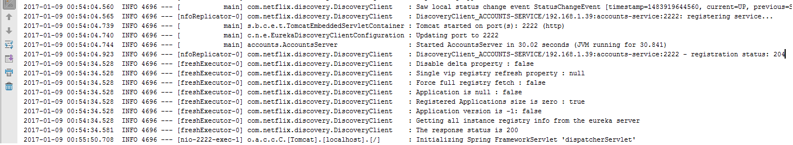
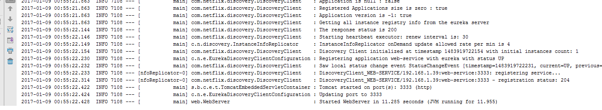
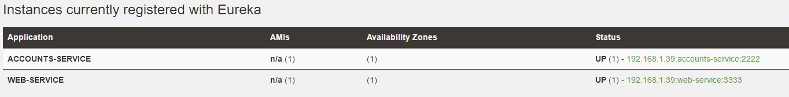
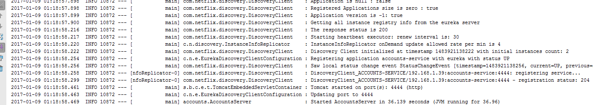
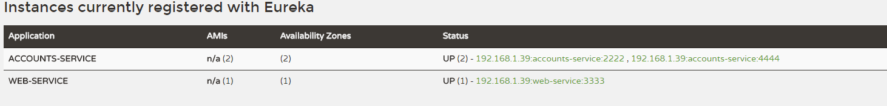

# lab6-microservices

Both services are running and registered

The service registration service has the two microservices registered

Microservice (port 4444) is also running and registered

### A brief report describing what happens when you kill the microservice with port 2222. Can the web service provide information about the accounts? Why?

After killing the account service (port 2222) the web service returns "Refused Connection" because the service at port 2222 is down. After that, it ask the registration service for another account service (port 4444) and works good again.
